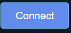
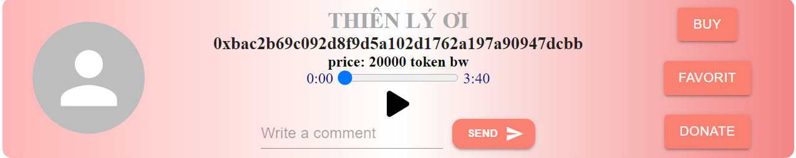
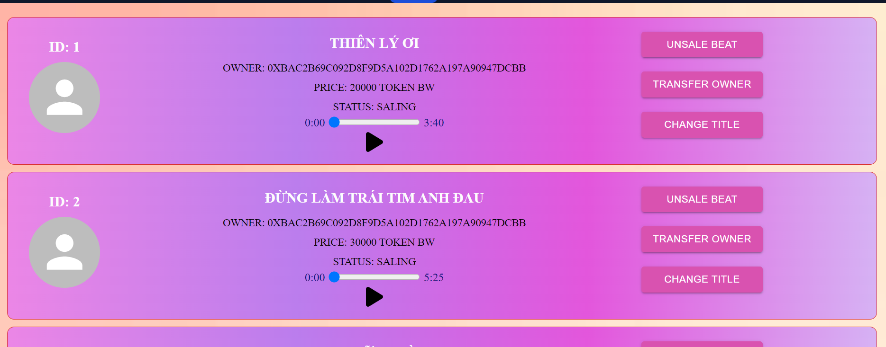

# BEATWAVE APP

Link to test web [Beatwave](https://appication-beatwave.vercel.app/home)

## How to run:
First, run the development local:

```bash
npm run build
```
Open [http://localhost:3000](http://localhost:3000) with your browser to see the result.

## About app
Use chain BSCTESTNET:

Address contract:
```bash
0xD568e9628dD89AE8F455171E244Ef746B429318b
```

Use token BW to transfer:
- You need buy token BW

First, connect with your wallet:


Contains 4 pages:

- [Home](https://appication-beatwave.vercel.app/home) - page Home to buy and view beat.
- [Manage](https://appication-beatwave.vercel.app/manage) - page manage to manage your beat.
- [Upload](https://appication-beatwave.vercel.app/upload) - page upload to upload beat to system.
- [About](https://appication-beatwave.vercel.app/about) - page about.

### Page Home:
This is the page used to view the list of music beats for sale and to exchange and buy and sell music:


```bash
button Buy to buy beat
```

### Page Manage:
Includes a list of beats you uploaded
- You can post for sale
- Transfer ownership to another person
- If it is for sale, it can be removed from sale
- Change title of beat



### Page Upload:
You can upload your beats and manage them
Can only download mp3 files and when the wallet is connected

### Page About:
about we
